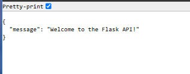

# Simple REST API locally on a Linux server using Python with the Flask Framework (Dev)

## Prerequisites:
1. Linux server (local or remote).
2. Python (version 3.x).
3. pip (Python's package installer).

### Steps to Build the API:

1. Install Required Tools
Open the terminal on your Linux server and run:

```bash
# Install Python3 and pip if not already installed
sudo apt update
sudo apt install python3 python3-pip -y
```

2. Install Flask
Use pip to install Flask:

```bash
pip3 install flask
```

3. Create the API Project Directory
Navigate to your preferred folder and create a new project directory:

```bash
mkdir my_api
cd my_api
```

4. Write the API Code
Open the app.py file using a text editor (like nano, vim, or VSCode), and paste the following code:

```python
from flask import Flask, jsonify, request

app = Flask(__name__)

# Root Endpoint
@app.route('/')
def home():
    return jsonify({"message": "Welcome to my API!"})

# Simple GET Endpoint
@app.route('/api/greet', methods=['GET'])
def greet():
    name = request.args.get('name', 'World')
    return jsonify({"greeting": f"Hello, {name}!"})

# Simple POST Endpoint
@app.route('/api/echo', methods=['POST'])
def echo():
    data = request.json
    return jsonify({"received_data": data})

# Run the Flask app
if __name__ == '__main__':
    app.run(host='127.0.0.1', port=5002, debug=True)
```

5. Run the API Server
Start the Flask API server by running:

```bash
python3 app.py
```
By default, Flask will start the server on port 5000. But for this app I used port 5002 because I had a docker image also running on port 5000
Ensure port 5002 is open in your firewall settings.

```bash
sudo ufw allow 5002
```

### Test the API

**a) Test the Root Endpoint** 
Open your browser or use curl:

```bash
curl http://127.0.0.1:5002/
```
Expected Output:

```json
{"message": "Welcome to my API!"}
```

**b) Test the GET Endpoint with Query Parameters**

```bash
curl "http://127.0.0.1:5002/api/greet?name=John"
```

Expected Output:

```json
{"greeting": "Hello, John!"}
```

**c) Test the POST Locally** 

Use curl to send JSON data:

```bash
curl -X POST -H "Content-Type: application/json" -d '{"key": "value"}' http://127.0.0.1:5002/api/echo
```

Expected Output:

```json
{"received_data": {"key": "value"}}
```

Stop the Server
To stop the server, press Ctrl + C.

### Test the API

To access the data from the movie database, **routes** will be used and to test if the app works and make it accessible to other devices on the same network, a route to display a simple message is used.

```python
@app.route("/")
def home():
    return jsonify({"message": "Welcome to the Flask API!"})
```
By default, Flask binds to 127.0.0.1 (localhost), which means it only listens for requests from the same machine. To allow external access, ensure the host is set to 0.0.0.0 in your app.run():

```python
if __name__ == "__main__":
    app.run(host="0.0.0.0", port=5002, debug=True)
```
This change makes Flask listen on all network interfaces, including the machine that the app is running on. E.g a linux server.


#### Final code for testing the app.

```python
from flask import Flask, jsonify, request
import sqlite3

app = Flask(__name__)

@app.route("/")
def home():
    return jsonify({"message": "Welcome to the Flask API!"})

if __name__ == "__main__":
    app.run(host="0.0.0.0", port=5002, debug=True)
```

To set the api, run

```bash
python3 app.py
```
Click on the link by using Ctrl + Click or copy URL and paste in the browser.

Expected output:




This section helped to get a better understanding of how set up APIs locally or externally and run the POST and GET requests or use **curl** command.

---


